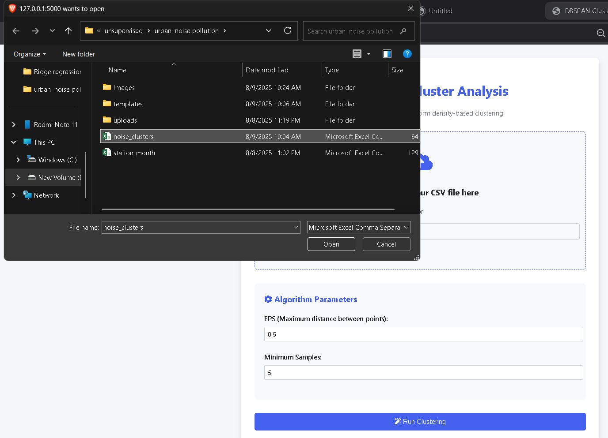
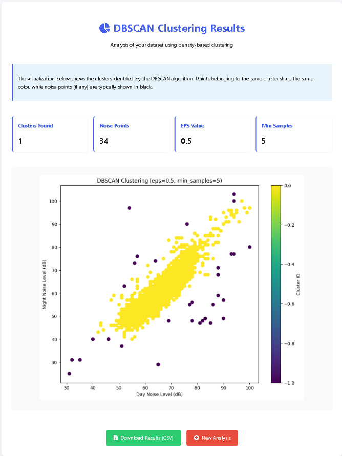

# Urban Noise Pollution Clustering (DBSCAN) Web App

This is a Flask web application that performs DBSCAN clustering on urban noise pollution data.
It allows you to upload a CSV file containing `Day` and `Night` noise levels, runs the clustering,
plots the results, and lets you download the clustered CSV.

## 📂 Project Structure

```
project/
│
├── Images/                     # Example screenshots and images
│   ├── image-1.png              # Home page / upload form screenshot
│   ├── image-2.png              # Clustering result screenshot
│   └── image-3.png              # Download CSV screenshot
│
├── templates/                  # HTML templates
│   ├── index.html               # Upload form
│   └── result.html              # Result page with cluster plot
│
├── uploads/                     # (Optional) Folder for uploaded CSVs
│
├── app.py                       # Main Flask app
├── dbscan.py                    # DBSCAN model code (optional separate file)
├── noise_clusters.csv           # Example clustered output
├── station_month.csv            # Example input dataset
└── README.md                    # Project documentation
```

## ⚙️ Installation

1. Clone the repository or download the source code.

2. Install dependencies:
```bash
pip install flask pandas scikit-learn matplotlib
```

3. Place your dataset (CSV with `Day` and `Night` columns) in the project directory.

## ▶️ Running the App

Run the Flask application:
```bash
python app.py
```

By default, the app runs at:
```
http://127.0.0.1:5000/
```

## 📊 How It Works

1. Upload a CSV file with at least two columns: `Day` and `Night` (noise levels in dB).
2. The app uses **DBSCAN** clustering with `StandardScaler` preprocessing.
3. A cluster plot is displayed in the browser.
4. A link is provided to download the clustered data as a CSV.

## 🧪 Example DBSCAN Code

```python
import pandas as pd
from sklearn.cluster import DBSCAN
from sklearn.preprocessing import StandardScaler
import matplotlib.pyplot as plt

# Load dataset
df = pd.read_csv("station_month.csv")

# Select relevant columns
X = df[['Day', 'Night']].dropna()

# Scale data
scaler = StandardScaler()
X_scaled = scaler.fit_transform(X)

# Apply DBSCAN
db = DBSCAN(eps=0.5, min_samples=5)
clusters = db.fit_predict(X_scaled)

# Add clusters
df_clean = X.copy()
df_clean['cluster'] = clusters

# Save results
df_clean.to_csv("noise_clusters.csv", index=False)
```

## 📷 Screenshots

### 1️⃣ Home Page


### 2️⃣ Upload data


### 3️⃣ Cluster Result


## 📌 Notes

- Make sure the uploaded file has numeric values in `Day` and `Night` columns.
- Adjust DBSCAN parameters (`eps`, `min_samples`) in `app.py` for better clustering results.
- The generated plot is displayed in the browser using `matplotlib` and base64 encoding.

---
💡 **Author:** Your Name  
📅 **Date:** 2025
